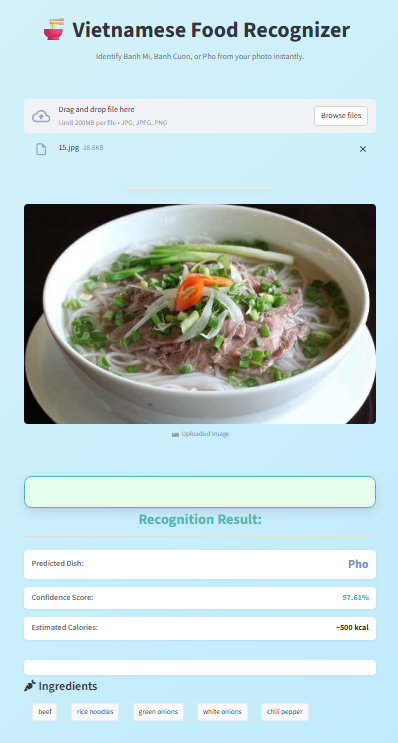

# 🍜 **Vietnamese Food Classification Web Application**

This project is a **Vietnamese Food Recognition and Classification System** built using **PyTorch**, **Streamlit**, and **Google Gemini AI**.  

It identifies at least **three Vietnamese dishes — Banh Mi, Banh Cuon, and Pho —** from uploaded images, and even detects their **main ingredients** using Gemini vision capabilities.

---

## 🌐 **Live Demo**
👉 Try it here: [https://vnfood-hmdk.streamlit.app/](https://vnfood-hmdk.streamlit.app/)

---

## 🧠 **Project Overview**

Food recognition and classification is a fascinating area of computer vision that teaches machines to recognize different types of food from images.  
With the rise of social media and the growing interest in healthy eating, there’s an increasing demand for systems that can **identify food items** and **analyze ingredients** automatically.

This project demonstrates how **deep learning** can be applied to real-world image classification tasks — specifically **Vietnamese cuisine** — by training a model and deploying it as an interactive web application.

---

## 🎯 **Project Requirements**

| No. | Criteria | Description | Weight |
|-----|-----------|-------------|--------|
| 1 | **Train the food model** | Train a deep learning model to classify at least 3 Vietnamese dishes. | 60% |
| 2 | **Deploy the model** | Build a web-based interface to upload or capture images for recognition. Ingredient extraction is a bonus. | 40% |

---

## 🧠 **Model Architecture (PyTorch)**
The model uses a **pretrained MobileNetV2** (ImageNet weights) as a frozen feature extractor, followed by custom classification layers.

```python
import torch.nn as nn
from torchvision import models

class VNFOODs(nn.Module):
    """
    PyTorch implementation of the Keras Sequential Model using MobileNetV2 as base.
    Input: 3 x 224 x 224
    Output: num_classes (softmax)
    """
    def __init__(self):
        super(VNFOODs, self).__init__()
        base_model = models.mobilenet_v2(
            weights=models.MobileNet_V2_Weights.IMAGENET1K_V1)

        for param in base_model.parameters():
            param.requires_grad = False
            
        self.feature_extractor = base_model.features
        self.classifier = nn.Sequential(
            nn.AdaptiveAvgPool2d((1, 1)),
            nn.Flatten(),
            nn.Linear(base_model.last_channel, 128),
            nn.ReLU(),
            nn.Dropout(0.3),
            nn.Linear(128, 3),
            nn.Softmax(dim=1)
        )

    def forward(self, x):
        x = self.feature_extractor(x)
        x = self.classifier(x)
        return x
```

### 🏋️ **Training Setup**
```python
criterion = nn.CrossEntropyLoss()
optimizer = optim.Adam(model.classifier.parameters(), lr=0.001)

# Unfreeze the last few layers for fine-tuning
for i, module in enumerate(model.feature_extractor):
    if i >= 12:
        for param in module.parameters():
            param.requires_grad = True

fine_tune_optimizer = optim.Adam(model.parameters(), lr=1e-5)
```

The model was first trained with frozen convolutional layers, then fine-tuned on the last few layers for improved accuracy.

### 📈 **Training & Fine Tuning Results**
* **Accuracy Score**: 0.9544
* **Classification Report**:
    ```bash
                  precision    recall  f1-score   support

       banh_cuon     0.9270    0.9474    0.9371       228
         banh_mi     0.9844    0.9403    0.9618       268
             pho     0.9467    0.9877    0.9668       162

        accuracy                         0.9544       658  
       macro avg     0.9527    0.9584    0.9552       658
    weighted avg     0.9552    0.9544    0.9545       658
    ```

---

## 🧩 **Project Structure**
```bash
📁 food_app/
├── .gitignore
├── README.md
├── credentials.py
├── main.py
├── example_run.png
├── requirements.txt
├── styles.css
├── utils.py
├── VNFOOD_model_weights.pth
└── vietfood-classifer.ipynb
```

## 🌐 **Streamlit Web Application**
The app allows user to upload an image and view the predicted dish with confidence.

Example output:<br>


---

## ⚙️ **Installation & Usage**
#### 1️⃣ **Clone the repository**
```bash
git clone https://github.com/ndrhmdk/VNFOOD.git
cd VNFOOD
```

#### 2️⃣ **Install dependencies**
```bash
pip install -r requirements.txt
```

#### 3️⃣ **Run the Streamlit app**
```bash
streamlit run app.py
```

Then open the link displayed in the terminal (usually `http://localhost:8501`).

---

## 🧾 **Requirements**
```nginx
# Core scientific/machine learning libraries
numpy
matplotlib
scikit-learn
torch
torchvision

# Streamlit application and utilities
streamlit
pandas
Pillow
tqdm
python-dotenv  # For load_dotenv

# Google Gemini API client
google-genai
```

---

## 🎯 **Key Features**
* Transfer Learning with **MobileNetV2**
* Clean and centered **Streamlit UI**
* Image upload and live prediction
* Fine-tuned model achieving ~96% accuracy
* Ready for deployment

## 🏁 **Future Improvements**
* Add more Vietnamese dishes to the dataset
* Integrate Grad-CAM visualization for interpretability
* Provide batch image classification support

## 👨‍💻 **Author**

**Kien, Hoang Mai Duc**<br>
📧 [LinkedIn](https://www.linkedin.com/in/hmdkien/) | [Gmail](andrhmdk@gmail.com)

---
> “Taste the code. Recognize the flavor.” 🍜